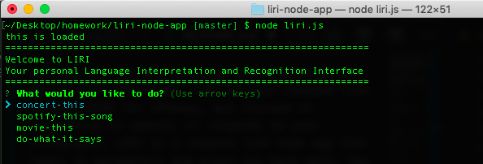
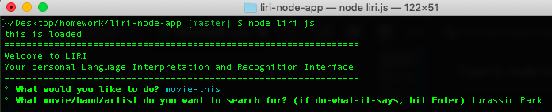
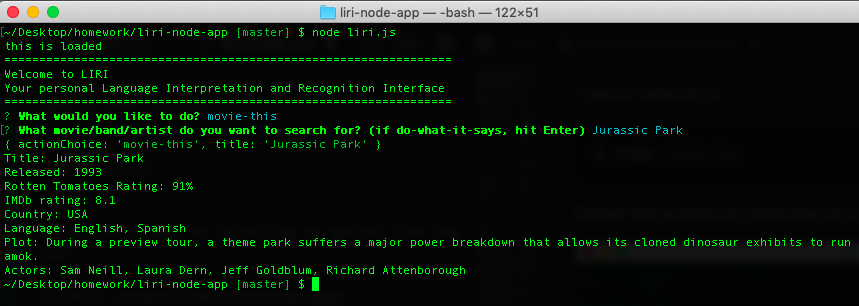

# LIRI (Node.js App)

Welcome to LIRI aka Language Interpretation and Recognition Interface. LIRI to your command line is like SIRI for iPhones, but instead of responding to speech, it responds to your *language*. LIRI is a command line node app that takes in parameters and gives you back data. You can use LIRI to acquire information about movies, songs, and upcoming tour dates of your favorite bands. Using Spotify API, BandsInTown API and OMDb API, your queries are limitless! 

## Getting Started

Download LIRI by cloning it to your computer or downloading it as a ZIP file. Once that is completed, you can access LIRI through your command line by using ```node liri.js``` and answering the prompt as follows using your arrow keys



### Prerequisites

Have node installed to your platform. If you do not have Node.js, click [here](https://nodejs.org/en/download/) to install the latest version.

### Installing

Follow these steps to get LIRI up and running

Go into the directory in which you have cloned LIRI 

```
$ cd node-liri-app/
```

Type in node liri.js

```
$ node liri.js
```

Follow the prompt by selecting an option from the list


Example of one of the options selected, in this case 'movie-this'



Hit enter, and ta-da!



## Built With

* [Node.js](https://nodejs.org/en/)
* [JavaScript](https://www.javascript.com/)
* [Node Spotify API](https://www.npmjs.com/package/node-spotify-api)
* [BandsInTown API](http://www.artists.bandsintown.com/bandsintown-api)
* [OMDb API](http://www.omdbapi.com/)
* [Moment.js](https://momentjs.com/)
* [file-system npm](https://www.npmjs.com/package/file-system)
* [request npm](https://www.npmjs.com/package/request)
* [inquirer npm](https://www.npmjs.com/package/inquirer)

## Authors

* **[Melika Kalbasi](https://github.com/melikalbasi)**

